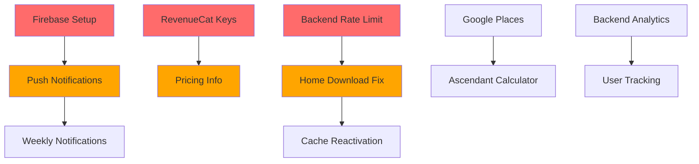

# Mapa de Integración: TODOs vs Plan Backend - Zodiac App

**Fecha:** 2025-10-05
**Objetivo:** Relacionar TODOs encontrados con el plan de integración backend existente

---

## Resumen Ejecutivo

De los **41 TODOs** identificados:

| Relación con Backend | Cantidad | Porcentaje |
|---------------------|----------|------------|
| ✅ Requiere Backend | 8 | 20% |
| ⚠️ Requiere Servicios Externos | 6 | 15% |
| ❌ Implementación Local | 27 | 65% |

**Conclusión Clave:**
Solo el 20% de los TODOs depende directamente del backend. La mayoría (65%) son implementaciones locales que pueden resolverse independientemente.

---

## TODOs que Requieren Backend Integration

### 1. Push Notifications System (CRÍTICO)

**TODOs Relacionados:**
- `prediction_notification_service.dart` (líneas 143, 149, 155, 245, 258, 270)

**Estado Actual:**
- ❌ Sin Firebase Cloud Messaging configurado
- ❌ Sin backend endpoint para notificaciones
- ❌ Sin almacenamiento de FCM tokens

**Requiere del Backend:**

```yaml
Phase 2: Push Notifications

Backend Requirements:
  - Endpoint: POST /api/notifications/register-token
    Payload: { userId, fcmToken, deviceInfo }
    Response: { success, tokenId }

  - Endpoint: POST /api/notifications/schedule
    Payload: { userId, notificationType, scheduledTime }
    Response: { success, notificationId }

  - Endpoint: DELETE /api/notifications/unregister-token
    Payload: { userId, tokenId }
    Response: { success }

N8N Workflows Necesarios:
  1. Daily Horoscope Notification Sender
     - Trigger: CRON (diario a las 08:00 hora local del usuario)
     - Action: Enviar FCM notification a usuarios activos
     - Data: Horóscopo diario personalizado

  2. Weekly Horoscope Notification Sender
     - Trigger: CRON (domingos a las 10:00)
     - Action: Enviar resumen semanal
     - Data: Preview de la semana astrológica

  3. Premium Timing Alerts
     - Trigger: Event-based (mejor momento detectado)
     - Action: Enviar alerta premium
     - Data: Oportunidad cósmica personalizada

Database Schema:
  fcm_tokens:
    - id: UUID
    - user_id: String
    - token: String (FCM token)
    - device_type: Enum(iOS, Android)
    - created_at: Timestamp
    - last_used_at: Timestamp
    - is_active: Boolean

  notification_preferences:
    - user_id: String (PK)
    - daily_enabled: Boolean
    - weekly_enabled: Boolean
    - timing_alerts_enabled: Boolean
    - quiet_hours_start: Time
    - quiet_hours_end: Time
    - preferred_time: Time
    - updated_at: Timestamp
```

**Timeline:**
- Backend Development: 8-12 horas
- Frontend Integration: 8-12 horas
- Testing: 4-6 horas
- **TOTAL: 20-30 horas (3-4 días)**

**Prioridad:** 🔴 CRÍTICA - Bloqueante para lanzamiento

---

### 2. Weekly Horoscopes Generation (ALTO)

**TODOs Relacionados:**
- `backend_service.dart` (líneas 476-478)
- Multiple localization files

**Estado Actual:**
- ✅ Backend endpoint existe: `/api/coaching/getDailyHoroscope`
- ❌ No devuelve contenido semanal real
- ❌ N8N workflow para weekly no existe

**Requiere del Backend:**

```yaml
Phase 2: Weekly Horoscopes

Backend Requirements:
  - Nuevo Endpoint: GET /api/coaching/getWeeklyHoroscope
    Params: sign, language
    Response: {
      sign: String,
      language_code: String,
      week_start: Date,
      week_end: Date,
      general_forecast: String,
      daily_highlights: [String],
      lucky_days: [String],
      challenging_days: [String],
      weekly_advice: String,
      love_weekly: String,
      work_weekly: String,
      health_weekly: String,
      overall_rating: Number(1-5)
    }

N8N Workflow:
  Name: Weekly Horoscope Generator
  Trigger: CRON (domingos a las 00:00 UTC)
  Steps:
    1. Get all zodiac signs (12)
    2. For each sign + language (6):
       - Call ChatGPT API with weekly prompt
       - Structure response
       - Cache in database
    3. Total: 72 weekly horoscopes generados

  Prompt Template:
    "Genera un horóscopo semanal detallado para {SIGN} en {LANGUAGE}.
     Semana del {START_DATE} al {END_DATE}.
     Incluye:
     - Pronóstico general semanal (150-200 palabras)
     - Destacados diarios (7 bullets)
     - Días afortunados y desafiantes
     - Consejo semanal específico
     - Amor, trabajo y salud (50 palabras c/u)

     Tono: {TONE_BASED_ON_SIGN}
     Estilo: Inspirador, práctico, accionable"

Database Schema:
  weekly_horoscopes:
    - id: UUID
    - sign: String
    - language_code: String
    - week_start: Date
    - week_end: Date
    - content: JSONB (todo el forecast)
    - generated_at: Timestamp
    - expires_at: Timestamp (week_end + 7 días)

  Index: (sign, language_code, week_start) UNIQUE
```

**Frontend Changes Needed:**

```dart
// backend_service.dart - Nuevo método
Future<Horoscope?> getWeeklyHoroscope(
  String signName, {
  String? languageCode,
}) async {
  try {
    languageCode ??= await _detectUserLanguage();
    final normalizedSign = _normalizeSignName(signName);

    // Check cache first
    final cacheKey = 'weekly_${normalizedSign}_$languageCode';
    final cached = await _getFromCache(normalizedSign, languageCode, 'weekly');
    if (cached != null) return cached;

    // Fetch from backend
    final response = await http.get(
      Uri.parse('$_baseUrl/api/coaching/getWeeklyHoroscope?sign=$normalizedSign&language=$languageCode'),
      headers: _getSecurityHeaders(),
    ).timeout(const Duration(seconds: 10));

    if (response.statusCode == 200) {
      final data = json.decode(response.body);
      final horoscope = _parseWeeklyHoroscopeData(data, normalizedSign, languageCode);
      await _saveToCache(normalizedSign, languageCode, 'weekly', horoscope);
      return horoscope;
    }

    return null;
  } catch (e) {
    AppLogger.error('Weekly Horoscope Error', e);
    return null;
  }
}
```

**Timeline:**
- Backend N8N Workflow: 6-8 horas
- Frontend Integration: 4-6 horas
- Testing: 2-3 horas
- **TOTAL: 12-17 horas (2 días)**

**Prioridad:** 🟠 ALTA - Feature premium importante

---

### 3. Home Screen Download Loop Fix (CRÍTICO)

**TODOs Relacionados:**
- `home_screen.dart` (línea 58)

**Estado Actual:**
- ❌ Download automático desactivado
- ❌ Causa loop infinito con Railway backend
- ✅ Método `downloadAllHoroscopes()` existe en `BackendService`

**Problema Root:**
```dart
// Código problemático (actualmente comentado)
@override
void initState() {
  super.initState();
  // 🚨 TEMPORALMENTE DESACTIVADO - Causa bucle infinito con Railway backend
  // await BackendService().downloadAllHoroscopes();
}
```

**Requiere del Backend:**

```yaml
Backend Fixes Necesarios:

1. Rate Limiting Implementado:
   - Max 10 requests por minuto por IP
   - Max 100 requests por hora por IP
   - Response headers con rate limit info:
     X-RateLimit-Limit: 10
     X-RateLimit-Remaining: 7
     X-RateLimit-Reset: 1696534800

2. Endpoint Optimizado:
   GET /api/coaching/getAllHoroscopes

   Current Issues:
   - No tiene timeout configurado
   - No tiene compression habilitada
   - Respuesta muy grande (72 horóscopos)

   Fixes Needed:
   - Enable GZIP compression
   - Add caching headers:
     Cache-Control: public, max-age=82800 (23 horas)
     ETag: "version-hash"
   - Implementar pagination opcional:
     ?page=1&per_page=12

3. Backend Logging:
   - Log duplicate requests from same client
   - Alert on suspicious patterns
   - Implement request deduplication
```

**Frontend Fixes Necesarios:**

```dart
// home_screen.dart - Fix propuesto
class _HomeScreenState extends State<HomeScreen> {
  bool _hasDownloadedToday = false;

  @override
  void initState() {
    super.initState();
    _initializeScreen();
  }

  Future<void> _initializeScreen() async {
    // Check if already downloaded today
    final prefs = await SharedPreferences.getInstance();
    final lastDownload = prefs.getString('last_download_date');
    final today = DateTime.now().toIso8601String().split('T')[0];

    if (lastDownload == today) {
      AppLogger.debug('Horóscopos ya descargados hoy, usando cache');
      _hasDownloadedToday = true;
      return;
    }

    // Download with exponential backoff
    try {
      AppLogger.info('Iniciando descarga de horóscopos del día');

      final success = await BackendService().downloadAllHoroscopes()
        .timeout(
          const Duration(seconds: 30),
          onTimeout: () {
            AppLogger.warning('Timeout en descarga, usando cache');
            return false;
          },
        );

      if (success) {
        await prefs.setString('last_download_date', today);
        _hasDownloadedToday = true;
        AppLogger.info('Descarga completada exitosamente');
      }
    } catch (e) {
      AppLogger.error('Error en descarga inicial', e);
      // Continuar con cache existente
    }
  }
}

// backend_service.dart - Add request deduplication
class BackendService {
  static DateTime? _lastDownloadAttempt;
  static const Duration _minTimeBetweenDownloads = Duration(minutes: 1);

  Future<bool> downloadAllHoroscopes({String? forLanguage}) async {
    // Prevent duplicate requests
    if (_lastDownloadAttempt != null) {
      final timeSinceLastAttempt = DateTime.now().difference(_lastDownloadAttempt!);
      if (timeSinceLastAttempt < _minTimeBetweenDownloads) {
        AppLogger.warning(
          'Download bloqueado: último intento hace ${timeSinceLastAttempt.inSeconds}s'
        );
        return false;
      }
    }

    _lastDownloadAttempt = DateTime.now();

    // Continue with existing download logic...
  }
}
```

**Timeline:**
- Backend Rate Limiting: 3-4 horas
- Frontend Deduplication: 2-3 horas
- Testing: 2-3 horas
- **TOTAL: 7-10 horas (1-2 días)**

**Prioridad:** 🔴 CRÍTICA - Bloqueante para lanzamiento

---

### 4. Backend Analytics Integration (MEDIO)

**TODOs Relacionados:**
- `core_compatibility_service.dart` (línea 563)
- Multiple analytics services

**Estado Actual:**
- ❌ User ID hardcoded a 'anonymous'
- ❌ Sin tracking de usuarios reales
- ❌ Sin backend para almacenar analytics

**Requiere del Backend:**

```yaml
Phase 3: Analytics Backend

Backend Requirements:
  - Endpoint: POST /api/analytics/event
    Payload: {
      userId: String,
      eventType: String,
      eventData: JSONB,
      timestamp: DateTime,
      sessionId: String,
      deviceInfo: Object
    }
    Response: { success, eventId }

  - Endpoint: GET /api/analytics/user-summary
    Params: userId
    Response: {
      totalEvents: Number,
      featureUsage: Object,
      lastActive: DateTime,
      engagementScore: Number
    }

Database Schema:
  analytics_events:
    - id: UUID
    - user_id: String
    - event_type: String
    - event_data: JSONB
    - timestamp: Timestamp
    - session_id: String
    - device_info: JSONB
    - created_at: Timestamp

  user_metrics:
    - user_id: String (PK)
    - total_sessions: Integer
    - total_events: Integer
    - features_used: JSONB
    - last_active: Timestamp
    - engagement_score: Float
    - tier: String
    - updated_at: Timestamp
```

**Timeline:**
- Backend Development: 6-8 horas
- Frontend Integration: 3-4 horas
- **TOTAL: 9-12 horas (1-2 días)**

**Prioridad:** 🟡 MEDIA - Post-lanzamiento

---

### 5. Backend Horoscope Notification Endpoint (CRÍTICO)

**TODOs Relacionados:**
- `backend_service.dart` (método `sendHoroscopeNotification`)

**Estado Actual:**
- ✅ Método existe en cliente
- ❓ Backend endpoint `/api/coaching/notify` - estado desconocido

**Requiere del Backend:**

```yaml
Backend Endpoint Verification:

Endpoint: POST /api/coaching/notify
Expected Payload: {
  userId: String,
  sign: String,
  message: String,
  language: String,
  timestamp: ISO8601
}

Expected Behavior:
  1. Validate user exists
  2. Get user's FCM token
  3. Send FCM notification with:
     - title: "Your Daily Horoscope"
     - body: message
     - data: { sign, language, type: 'daily' }
  4. Log notification sent
  5. Return success/failure

Error Handling:
  - 404: User not found
  - 400: Invalid FCM token
  - 500: FCM service error
```

**Timeline:**
- Verificar endpoint: 1 hora
- Implementar si no existe: 4-6 horas
- Testing: 2-3 horas
- **TOTAL: 3-10 horas**

**Prioridad:** 🔴 CRÍTICA - Parte de Push Notifications

---

### 6. Backend Cache Invalidation (MEDIO)

**TODOs Relacionados:**
- `ultimate_compatibility_service.dart` (cache desactivado)
- `compatibility_cache_service.dart` (múltiples managers deshabilitados)

**Requiere del Backend:**

```yaml
Backend Cache Strategy:

Headers de Respuesta:
  Cache-Control: public, max-age=82800  # 23 horas
  ETag: "content-version-hash"
  Last-Modified: <timestamp>
  Expires: <tomorrow-midnight-UTC>

Endpoints con Cache:
  - /api/coaching/getDailyHoroscope
  - /api/coaching/getWeeklyHoroscope (nuevo)
  - /api/coaching/getAllHoroscopes

Cliente debe:
  1. Respetar Cache-Control headers
  2. Enviar If-None-Match con ETag
  3. Manejar 304 Not Modified responses
  4. Invalidar cache local a medianoche
```

**Timeline:**
- Backend Headers: 2-3 horas
- Cliente Cache Logic: 4-6 horas
- **TOTAL: 6-9 horas**

**Prioridad:** 🟡 MEDIA - Optimización

---

### 7. User Authentication & Profile Backend (MEDIO)

**TODOs Relacionados:**
- Múltiples referencias a `userId: 'anonymous'`
- `PreferencesService` necesita user backend

**Requiere del Backend:**

```yaml
Phase 4: User Management

Backend Requirements:
  - Endpoint: POST /api/users/register
    Payload: { email?, appleId?, googleId?, deviceId }
    Response: { userId, token, profile }

  - Endpoint: GET /api/users/profile
    Headers: Authorization: Bearer <token>
    Response: { userId, profile, preferences, subscription }

  - Endpoint: PUT /api/users/profile
    Payload: { birthDate, birthTime, birthPlace, ascendant, ... }
    Response: { success, profile }

  - Endpoint: POST /api/users/sync
    Payload: { localData: JSONB }
    Response: { merged: JSONB, conflicts: Array }

Database Schema:
  users:
    - user_id: UUID (PK)
    - email: String (unique, nullable)
    - apple_id: String (unique, nullable)
    - google_id: String (unique, nullable)
    - device_id: String (unique, nullable)
    - created_at: Timestamp
    - last_login: Timestamp
    - is_anonymous: Boolean

  user_profiles:
    - user_id: UUID (FK)
    - birth_date: Date
    - birth_time: Time
    - birth_place: String
    - latitude: Float
    - longitude: Float
    - zodiac_sign: String
    - ascendant_sign: String
    - preferences: JSONB
    - updated_at: Timestamp
```

**Timeline:**
- Backend Development: 16-20 horas
- Frontend Integration: 8-12 horas
- **TOTAL: 24-32 horas (3-4 días)**

**Prioridad:** 🟡 MEDIA - Post-lanzamiento prioritario

---

### 8. Backend Logging & Monitoring (BAJO)

**TODOs Relacionados:**
- Múltiples servicios necesitan backend logging
- Security incidents reporting

**Requiere del Backend:**

```yaml
Backend Monitoring:

Endpoints:
  - POST /api/monitoring/error
    Payload: { errorType, message, stackTrace, context }

  - POST /api/monitoring/performance
    Payload: { metric, value, timestamp, metadata }

  - POST /api/monitoring/security-incident
    Payload: { incidentType, severity, details }

Integration:
  - Sentry or similar error tracking
  - Prometheus for metrics
  - CloudWatch/Datadog for logs
```

**Timeline:**
- Backend Setup: 8-12 horas
- **TOTAL: 8-12 horas**

**Prioridad:** 🟢 BAJA - Nice to have

---

## TODOs que Requieren Servicios Externos

### 1. Firebase Cloud Messaging (FCM)

**Servicio:** Firebase
**TODOs Afectados:** Push Notifications (#1-9)

**Setup Necesario:**
```yaml
Firebase Configuration:
  1. Create Firebase project
  2. Add iOS app (Bundle ID)
  3. Add Android app (Package name)
  4. Download config files:
     - iOS: GoogleService-Info.plist
     - Android: google-services.json
  5. Enable Cloud Messaging
  6. Get Server Key para backend

Flutter Setup:
  dependencies:
    firebase_core: latest
    firebase_messaging: latest
    flutter_local_notifications: latest

iOS Setup:
  - Enable Push Notifications capability
  - Configure APNs certificates
  - Update Info.plist

Android Setup:
  - Update AndroidManifest.xml
  - Configure notification channels
```

**Costo:** FREE (hasta 1M mensajes/mes)
**Timeline:** 4-6 horas
**Prioridad:** 🔴 CRÍTICA

---

### 2. RevenueCat

**Servicio:** RevenueCat
**TODOs Afectados:** API Keys (#30), Pricing Info (#1)

**Setup Necesario:**
```yaml
RevenueCat Configuration:
  1. Create RevenueCat account
  2. Create project
  3. Get API Keys:
     - iOS: Public App-Specific API Key
     - Android: Public App-Specific API Key
  4. Configure products/entitlements
  5. Link to App Store Connect / Google Play Console

Flutter Integration:
  - Replace placeholder keys
  - Test purchases in sandbox
  - Verify subscription flow
```

**Costo:** FREE (hasta $10k MTR), luego 1% de revenue
**Timeline:** 2-3 horas
**Prioridad:** 🔴 CRÍTICA

---

### 3. Google Places API

**Servicio:** Google Cloud Platform
**TODOs Afectados:** Place Picker (#3)

**Setup Necesario:**
```yaml
Google Cloud Setup:
  1. Create GCP project
  2. Enable Places API
  3. Get API Key
  4. Restrict key (iOS/Android apps)
  5. Setup billing

Flutter Integration:
  dependencies:
    google_places_flutter: latest

  Implementation:
    - Place search UI
    - Get coordinates from place
    - Store for ascendant calculation
```

**Costo:** $17 por 1000 requests (SKU: Place Details)
**Timeline:** 3-4 horas
**Prioridad:** 🟠 ALTA

---

### 4. Google Calendar API

**Servicio:** Google Cloud Platform
**TODOs Afectados:** Calendar Connection (#33)

**Setup Necesario:**
```yaml
Google Cloud Setup:
  1. Enable Google Calendar API
  2. Configure OAuth 2.0 consent screen
  3. Create OAuth credentials (iOS/Android)
  4. Configure redirect URIs

Flutter Integration:
  dependencies:
    google_sign_in: latest
    googleapis: latest

  Implementation:
    - OAuth flow
    - Calendar permission request
    - Event creation/sync
```

**Costo:** FREE (quota: 1M requests/day)
**Timeline:** 8-12 horas
**Prioridad:** 🟡 MEDIA

---

### 5. Apple Sign In

**Servicio:** Apple Developer
**TODOs Afectados:** Authentication system

**Setup Necesario:**
```yaml
Apple Developer Setup:
  1. Enable Sign in with Apple capability
  2. Configure App ID
  3. No API key needed (uses certificates)

Flutter Integration:
  dependencies:
    sign_in_with_apple: latest

  Implementation:
    - Sign in flow
    - Handle credentials
    - Link to backend user
```

**Costo:** FREE (included in developer account)
**Timeline:** 4-6 horas
**Prioridad:** 🟡 MEDIA

---

### 6. Microsoft Graph API (Outlook)

**Servicio:** Microsoft Azure
**TODOs Afectados:** Outlook Calendar (#34)

**Setup Necesario:**
```yaml
Azure Setup:
  1. Register app in Azure AD
  2. Configure permissions (Calendar.ReadWrite)
  3. Get Application ID
  4. Configure redirect URIs

Flutter Integration:
  dependencies:
    aad_oauth: latest
    http: latest
```

**Costo:** FREE (personal accounts)
**Timeline:** 12-16 horas
**Prioridad:** 🟢 BAJA (Enterprise feature)

---

## Roadmap de Implementación Integrado

### PHASE 1: Pre-Launch Critical (5-7 días)

**Semana 1 - Días 1-2: Setup Crítico**
```
✅ Configurar RevenueCat API Keys (2h)
✅ Configurar Firebase Project (4h)
✅ Setup FCM para iOS/Android (6h)
✅ Backend: Implementar rate limiting (4h)
✅ Frontend: Fix home download loop (4h)

Total: 20 horas
```

**Semana 1 - Días 3-5: Push Notifications**
```
✅ Backend: Endpoint /api/notifications/register-token (4h)
✅ Backend: N8N workflow daily notifications (6h)
✅ Frontend: FCM integration (8h)
✅ Frontend: Local notifications (4h)
✅ Frontend: Preferences storage (3h)
✅ Testing end-to-end (5h)

Total: 30 horas
```

**Semana 1 - Revisión:**
- ✅ RevenueCat operativo
- ✅ Push notifications funcionando
- ✅ Home screen sin loops
- ✅ Backend estable con rate limiting

---

### PHASE 2: Post-Launch Priority (3-5 días)

**Semana 2 - Días 1-2: Premium Features**
```
✅ Google Places API setup (2h)
✅ Ascendant place picker (3h)
✅ Connect ascendant UI to service (2h)
✅ Backend: Weekly horoscope N8N (6h)
✅ Frontend: Weekly horoscope UI (4h)

Total: 17 horas
```

**Semana 2 - Días 3-4: Cache & Performance**
```
✅ Backend: Cache headers implementation (3h)
✅ Frontend: Reactivate compatibility cache (6h)
✅ Frontend: Memory pressure handler (4h)
✅ Testing cache behavior (3h)

Total: 16 horas
```

**Semana 2 - Revisión:**
- ✅ Ascendant calculator funcionando
- ✅ Weekly horoscopes generándose
- ✅ Cache optimizado y estable
- ✅ Performance mejorado

---

### PHASE 3: Optimizations (2-3 días)

**Semana 3 - Analytics & User Management**
```
✅ Pricing info provider (3h)
✅ User ID tracking in analytics (3h)
✅ Backend: Analytics endpoints (8h)
✅ Frontend: Analytics integration (4h)

Total: 18 horas
```

---

### PHASE 4: Future Features (Backlog)

**Calendar Integrations**
```
⏳ Google Calendar integration (12h)
⏳ Background calendar processor (8h)
⏳ Outlook/Exchange sync (16h)

Total: 36 horas
```

**Export & Sharing**
```
⏳ PDF export (6h)
⏳ CSV export (4h)
⏳ Share optimization (4h)

Total: 14 horas
```

**Advanced Features**
```
⏳ AI Insights Generator (12h)
⏳ Consultation sessions (16h)
⏳ Advanced monetization tactics (20h)

Total: 48 horas
```

---

## Dependencias entre TODOs



---

## Matriz de Priorización

| TODO | Backend Req | External Svc | Local Impl | Priority | Effort | Impact |
|------|------------|--------------|------------|----------|--------|--------|
| RevenueCat Keys | ❌ | ✅ | ✅ | 🔴 | 2h | Alto |
| Push Notifications | ✅ | ✅ | ✅ | 🔴 | 30h | Alto |
| Home Download Loop | ✅ | ❌ | ✅ | 🔴 | 10h | Alto |
| Weekly Horoscopes | ✅ | ❌ | ✅ | 🟠 | 17h | Medio |
| Ascendant Calculator | ❌ | ✅ | ✅ | 🟠 | 7h | Medio |
| Cache Reactivation | ⚠️ | ❌ | ✅ | 🟠 | 10h | Medio |
| User Analytics | ✅ | ❌ | ✅ | 🟡 | 12h | Bajo |
| Google Calendar | ❌ | ✅ | ✅ | 🟡 | 12h | Bajo |
| Export Features | ❌ | ❌ | ✅ | 🟢 | 14h | Bajo |

---

## Conclusiones y Recomendaciones

### Hallazgos Clave:

1. **Solo 8 TODOs (20%) requieren backend**
   - Puede acelerarse el desarrollo trabajando en paralelo
   - Frontend team: TODOs locales (27 items)
   - Backend team: Endpoints + N8N workflows (8 items)

2. **Push Notifications es la dependencia más compleja**
   - Requiere: Firebase + Backend + N8N workflows
   - Es el item más crítico: 30 horas de esfuerzo
   - Bloqueante para features premium

3. **Performance issues significativos**
   - Cache desactivado por crashes de memoria
   - Download loop sin resolver
   - Requiere investigación y testing profundo

4. **Servicios externos bien identificados**
   - Firebase (FCM): CRÍTICO
   - RevenueCat: CRÍTICO
   - Google Places: ALTO
   - Google Calendar: MEDIO
   - Outlook: BAJO

### Recomendaciones Ejecutivas:

#### Para MVP Launch (Bloqueantes):
1. ✅ Configurar RevenueCat (2h)
2. ✅ Configurar Firebase (4h)
3. ✅ Implementar Push Notifications (30h)
4. ✅ Resolver Home Download Loop (10h)

**Total Crítico: ~46 horas (6 días con 1 dev)**

#### Para Launch Success (Importantes):
1. ✅ Weekly Horoscopes (17h)
2. ✅ Ascendant Calculator (7h)
3. ✅ Cache Optimization (10h)

**Total Importante: ~34 horas (4 días con 1 dev)**

#### Post-Launch (Optimizaciones):
- Analytics Backend (12h)
- Calendar Integrations (36h)
- Export Features (14h)

**Total Optimización: ~62 horas**

### Timeline Realista:

**Con 1 Developer:**
- MVP Launch: 10 días laborables
- Launch Success: 14 días laborables
- Full Features: 25 días laborables

**Con 2 Developers (1 Backend, 1 Frontend):**
- MVP Launch: 5-6 días laborables
- Launch Success: 8-9 días laborables
- Full Features: 15 días laborables

### Riesgos Identificados:

1. 🔴 **ALTO:** Push Notifications no funcionando
   - Mitigation: Priorizar en Sprint 1
   - Fallback: Usar in-app notifications temporalmente

2. 🟡 **MEDIO:** Cache crashes de memoria
   - Mitigation: Testing exhaustivo en dispositivos low-end
   - Fallback: Desactivar cache temporalmente si es necesario

3. 🟢 **BAJO:** Features premium incompletas
   - Mitigation: Feature flags para activar gradualmente
   - Fallback: Marcar como "Coming Soon"

---

**Generado por:** Claude Code Agent
**Última actualización:** 2025-10-05
**Próxima revisión:** Después de completar Phase 1
